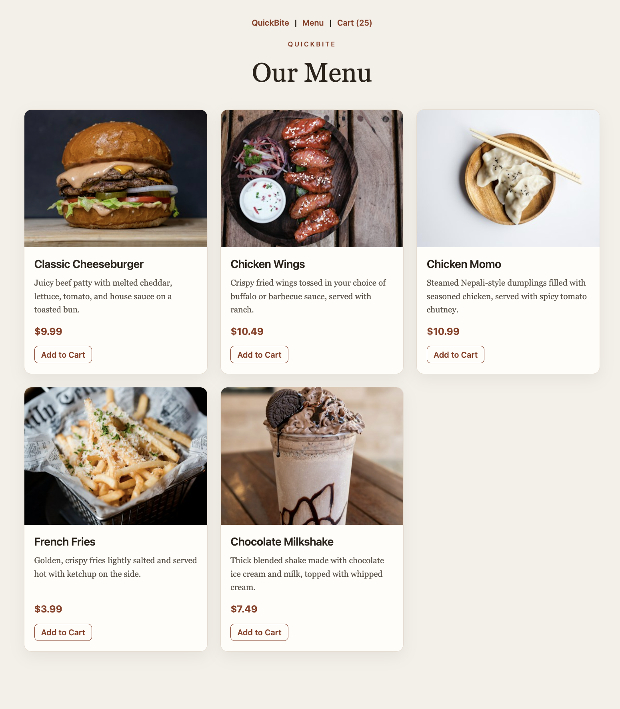
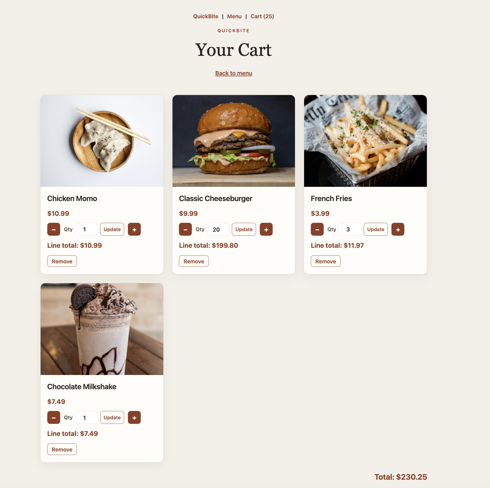

# QuickBite

QuickBite is a small Django web app for a restaurant pickup menu. Customers can browse products and keep a session shopping cart. The restaurant owner manages products in Django admin.

The Django project lives in `Quick_Bite/`.

## What the finished app looks like

Menu page (`http://127.0.0.1:8000/`):



Cart page (`http://127.0.0.1:8000/cart/`):



Customers can add a product, change its quantity (1 through 20), and remove it. The cart belongs to the browser session. There is no checkout.

## Requirements

- Python 3.12 or newer
- Git

## Run it from a fresh clone

```bash
git clone https://github.com/Ashwin-Dhakal/CSC_440.git
cd CSC_440/Quick_Bite
python3 -m venv venv
```

Activate the virtual environment:

```bash
# macOS / Linux
source venv/bin/activate

# Windows
venv\Scripts\activate
```

Install dependencies, create the database, and load the five sample products:

```bash
pip install -r requirements.txt
python manage.py migrate
python manage.py loaddata products
python manage.py runserver
```

Open [http://127.0.0.1:8000/](http://127.0.0.1:8000/).

## Owner login

Product create, edit, and delete are in Django admin. Create an owner account once:

```bash
python manage.py createsuperuser
```

Then open [http://127.0.0.1:8000/admin/](http://127.0.0.1:8000/admin/) and sign in. Menu and cart pages do not require a customer account.

## Sample products

`python manage.py loaddata products` loads:

| Product | Price |
|---------|-------|
| Classic Cheeseburger | 9.99 |
| Chicken Wings | 11.49 |
| Chicken Momo | 10.99 |
| French Fries | 3.99 |
| Chocolate Milkshake | 5.49 |

Running `loaddata products` again overwrites those five rows, including any later edits made in admin.
